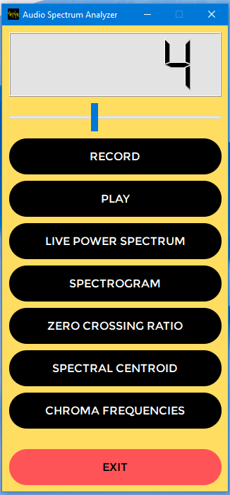
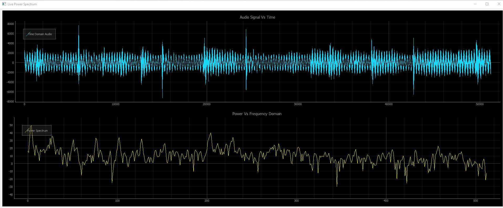
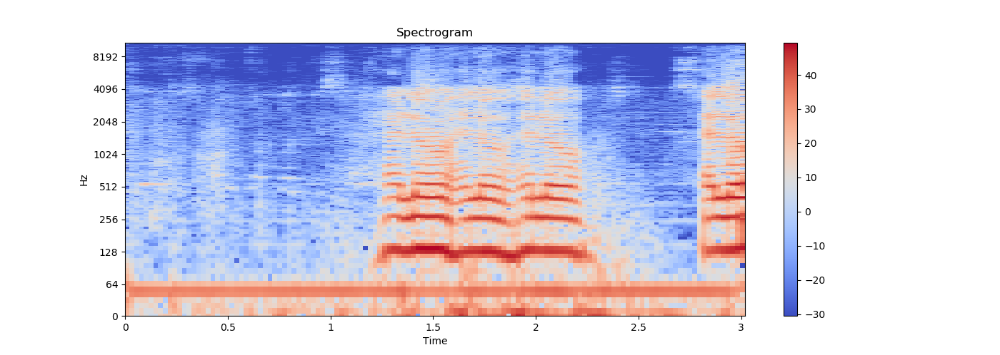
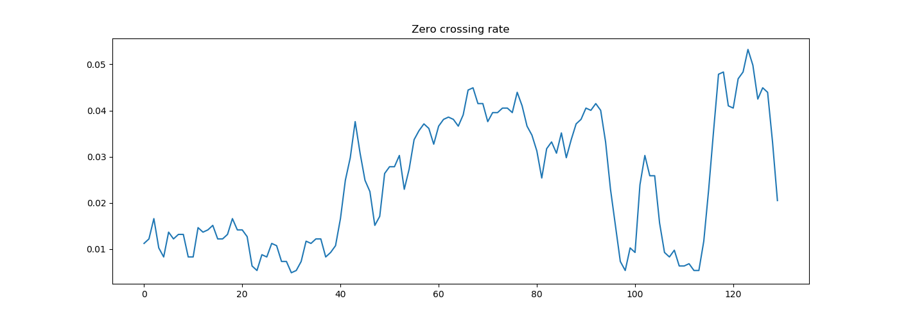
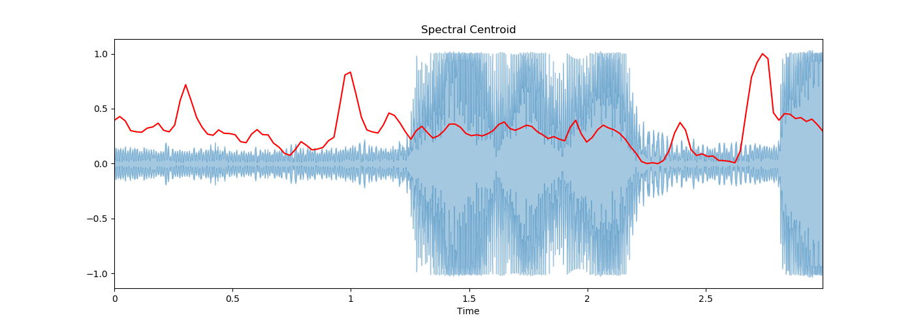
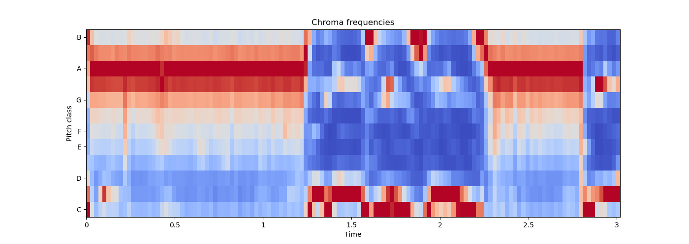

# Audio_Spectrum_Analyzer_with_GUI

Audio spectrum analyzer with GUI Project

Respository: [Audio_Spectrum_Analyzer_with_GUI](https://github.com/ravimallah8/Audio_Spectrum_Analyzer_with_GUI)

## Screenshots
Home GUI
------------


Live Power Spectrum
------------



Spectrogram
------------



Zero crossing ratio
------------



Spectral centroid
------------



Chroma frequencies
------------


Requirements
------------

- Python >= 3.3
- PyQt5
- PyQtGraph
- Numpy
- Matplotlib


Usage
------------
```shell
./applicaton.py
```
